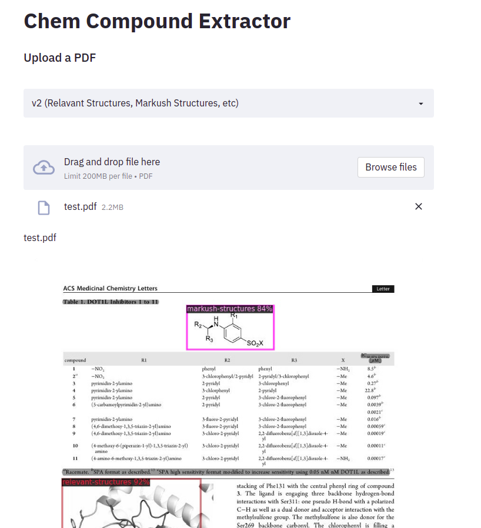
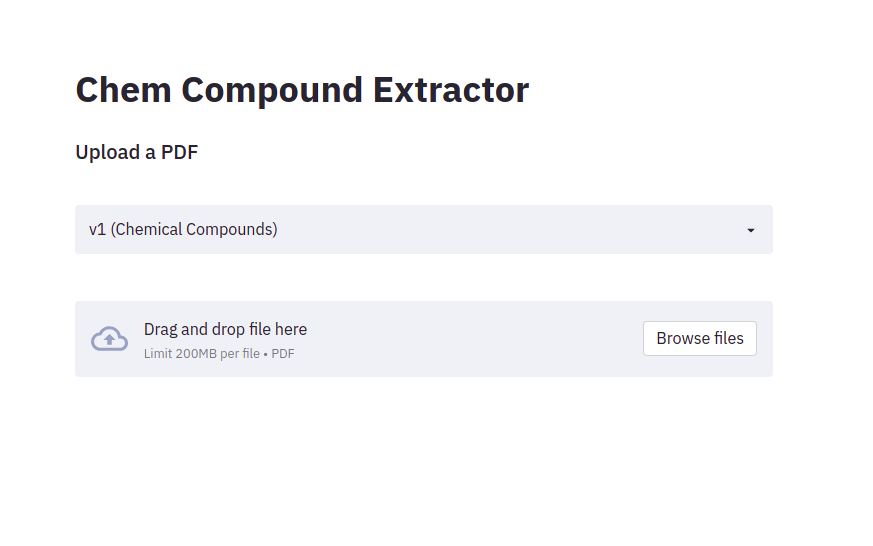
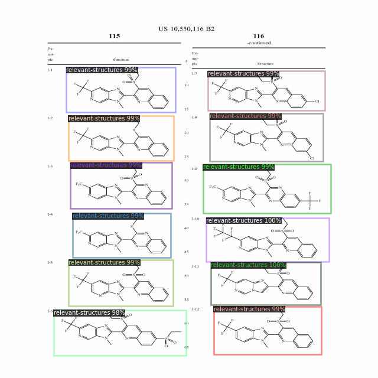
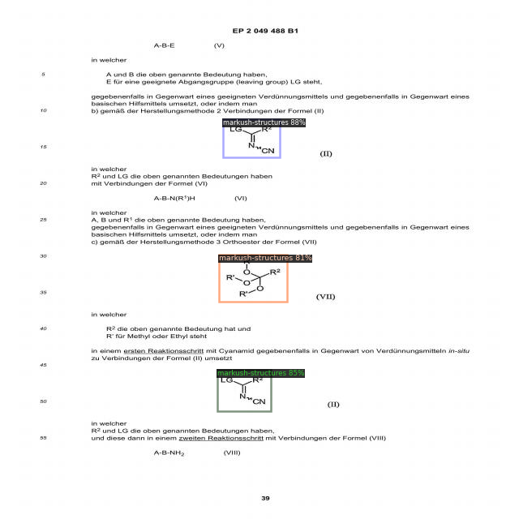
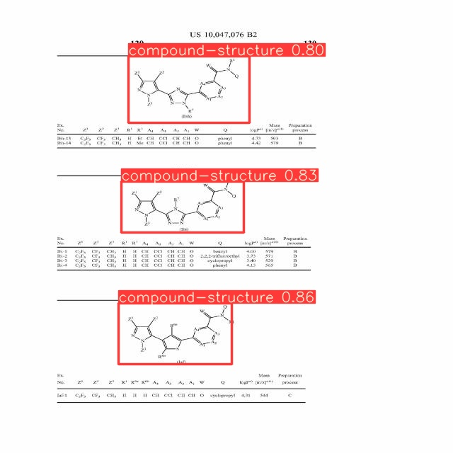
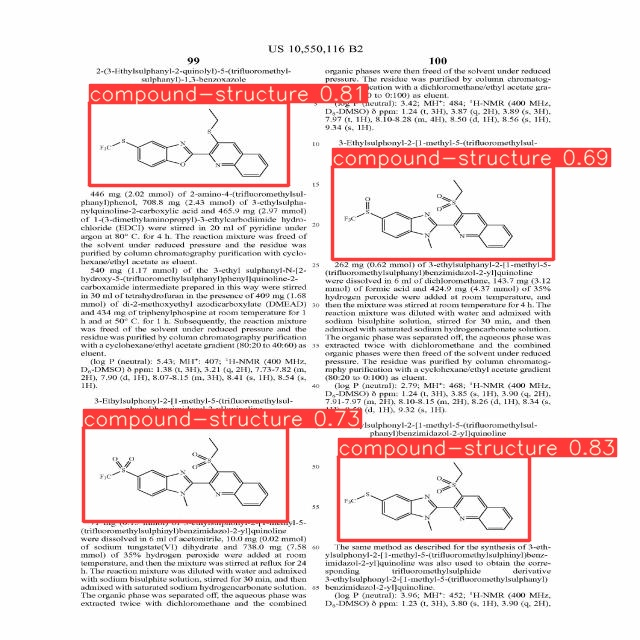

# Chemical Structure Extraction

> A web app that leverages Deep Learning to detect relavant chemical structures in patent documents.

> This project was built during the course of my internship at [iReadRx](http://www.ireadrx.ai/)


<!--  |  -->
<p float="left">
  
  
</p>


Learn more by checking out the [blog posts](#blogs) linked below.

<!-- ## Live Demo

[Live Demo Link](https://livedemo.com) -->

## Models Used
### v1 (chemical structure detection):
**[Dataset](./compound_structures_data)**

I trained a YOLOv5 model on images (pdf pages) containing organic compound structures annotated by our chemistry team. 

Transfer learning along with Hyper parameter evolution using a  genetic algorithm provided great training results.


**[Training Notebook](./colab_notebooks/YOLOv5_Training.ipynb)**

### v2 (Distinguishing between reactions, relevant structures, intermediates, etc)

**[Dataset](./new_dataset)**

As YOLOv5 didn't perform well on the new dataset, Detectron 2 was used.


**[Training Notebook](./colab_notebooks/Faster_RCNN_Detectron2.ipynb)**

## Getting Started

To get a local copy up and running follow these simple example steps.

```bash
git clone https://github.com/shashank524/patent_analysis.git
cd patent_analysis
```

### Colab
If you want to train the models, or just learn more about how this project works hands on, colab would be the best place to do so. All the required colab notebooks are [here](./colab_notebooks/).

The first few cells take care of the installation. 

### Docker
The [Dockerfile](./Dockerfile) by default builds the image to run both YOLO and Detectron 2. 

If you want to use Detectron2 alone, or both YOLOv5 and Detectron2 together, run the following commands directly.

```bash
docker build -t compoundextractor .
```

If you don't want to use Detectron2, comment the following lines in the [Dockerfile](./Dockerfile). It is okay if you don't do so, doing this will only reduce the size of the docker image.


```docker
RUN pip install --user torch==1.9 torchvision==0.10 -f https://download.pytorch.org/whl/cu111/torch_stable.html
RUN pip install --user 'git+https://github.com/facebookresearch/fvcore'
RUN pip install cython pyyaml==5.1
RUN pip install -U 'git+https://github.com/cocodataset/cocoapi.git#subdirectory=PythonAPI'
RUN python -m pip install 'git+https://github.com/facebookresearch/detectron2.git'
```

Finally run the container:

```bash
docker run -p 8501:8501 compoundextractor:latest
```

### Without Docker

Run the following commands in your terminal to setup everything required without docker.

```bash
pip install -r requirements.txt

pip install --user torch==1.9 torchvision==0.10 -f https://download.pytorch.org/whl/cu111/torch_stable.html
pip install --user 'git+https://github.com/facebookresearch/fvcore'
pip install cython pyyaml==5.1
pip install -U 'git+https://github.com/cocodataset/cocoapi.git#subdirectory=PythonAPI'
python -m pip install 'git+https://github.com/facebookresearch/detectron2.git'
```
Run the Streamlit app

```bash
streamlit run app.py
```
## Results

<p float="centre">
  
  
</p>
<p float="centre">
  
  
</p>
<!--  -->

## How do you build on top of this?

I have divided each part of this project from **training** to **deployment** into seperate colab notebooks.

Let's say you wanted to know why I chose to perform inference a certain way, you can look at the relavant colab notebook and perhaps find a better way to do the same thing.

- [YOLOv5 Training](./colab_notebooks/YOLOv5_Training.ipynb)
- [YOLOv5 Inference](./colab_notebooks/YOLOv5_inference.ipynb)
- [Detectron2 Training](./colab_notebooks/Faster_RCNN_Detectron2.ipynb)
- [Detectron2 Inference](./colab_notebooks/Detectron2inference.ipynb)
- [Streamlit app](./colab_notebooks/streamlit.ipynb)

<!-- <a name="blogs"></a> -->
<div id="blogs">

## Blog posts on this project

- [Chemical Patent Analysis Beyond Simple OCR](https://medium.com/ireadrx/chemical-patent-analysis-beyond-simple-ocr-24d0a5995c4c)
- [Detectron2 vs. Yolov5 (Which One Suits Your Use Case Better?)](https://medium.com/ireadrx/detectron2-vs-yolov5-which-one-suits-your-use-case-better-d959a3d4bdf)
</div>


## iReadRx Blog
<!-- BLOG-POST-LIST:START -->
- [Detectron2 vs. Yolov5 (Which One Suits Your Use Case Better?)](https://medium.com/ireadrx/detectron2-vs-yolov5-which-one-suits-your-use-case-better-d959a3d4bdf?source=rss----e01cee636e0c---4)
- [Chemical Patent Analysis Beyond Simple OCR](https://medium.com/ireadrx/chemical-patent-analysis-beyond-simple-ocr-24d0a5995c4c?source=rss----e01cee636e0c---4)
- [Visualizing Relationships between Chemicals and Patent Data](https://medium.com/ireadrx/visualizing-relationships-between-chemicals-and-patent-data-f317d7c8bea9?source=rss----e01cee636e0c---4)
- [Building Similar Patent Recommendations for Chemistry Patents](https://medium.com/ireadrx/building-similar-patent-recommendations-for-chemistry-patents-c68932c05796?source=rss----e01cee636e0c---4)
- [Building Topic Models for Organic Chemistry Patents](https://medium.com/ireadrx/building-topic-models-for-organic-chemistry-patents-1610630bd2aa?source=rss----e01cee636e0c---4)
<!-- BLOG-POST-LIST:END -->


## 🤝 Contributing

Contributions, issues, and feature requests are welcome!

Feel free to check the [issues page](../../issues/).

## Show your support

Give a ⭐️ if you like this project!

## Acknowledgements

- [Streamlit](https://streamlit.io/)
- [Roboflow](http://roboflow.com/)
- [YOLOv5](https://github.com/ultralytics/yolov5/)
- [Detectron2](https://github.com/facebookresearch/detectron2/)


## 📝 License

This project is [MIT](./LICENSE) licensed.
